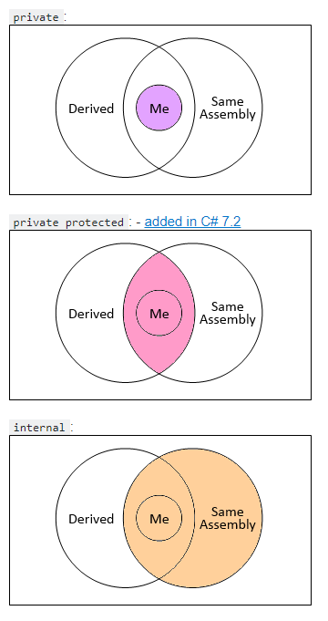
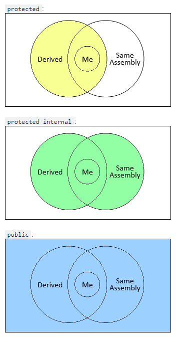

# Основные моменты C# 7.0

## Модификаторы доступа

Модификаторы доступа <https://metanit.com/sharp/tutorial/3.2.php>

В C# применяются следующие модификаторы доступа:

**public**: публичный, общедоступный класс или член класса. Такой член класса доступен из любого места в коде, а также из других программ и сборок.

**private**: закрытый класс или член класса. Представляет полную противоположность модификатору public. Такой закрытый класс или член класса доступен только из кода в том же классе или контексте.

**protected**: такой член класса доступен из любого места в текущем классе или в производных классах. При этом производные классы могут располагаться в других сборках.

**internal**: класс и члены класса с подобным модификатором доступны из любого места кода в той же сборке, однако он недоступен для других программ и сборок (как в случае с модификатором public).

**protected internal**: совмещает функционал двух модификаторов. Классы и члены класса с таким модификатором доступны из текущей сборки и из производных классов.

**private protected**: такой член класса доступен из любого места в текущем классе или в производных классах, которые определены в той же сборке.

Объявление полей класса без модификатора доступа равнозначно их объявлению с модификатором private. Классы, объявленные без модификатора, по умолчанию имеют доступ internal.

Все классы и структуры, определенные напрямую в пространствах имен и не являющиеся вложенными в другие классы, могут иметь только модификаторы public или internal.

## Диаграмма Эйлера-Венна для модификаторов доступа

